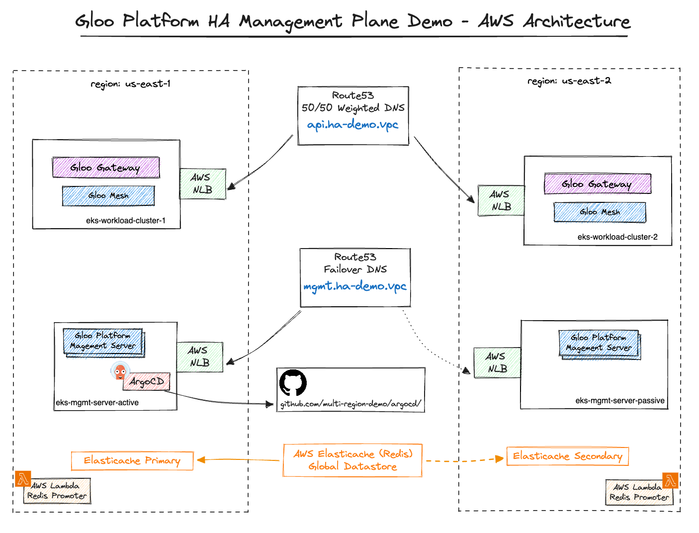

# Gloo Platform Multi-Region HA Management Plane Demo

This repo contains all artifacts used to create the HA multi-region management plane demo.

Terraform creates all AWS resources (EKS clusters, vpcs, etc.) and ArgoCD creates all Kubernetes resources in all EKS clusters.

See [./terraform-eks/README.md](./terraform-eks/README.md) for detailed instructions on deploying the demo yourself.

**Links to youtube and blog**

# Repo Contents

|path|description|
|---|---|
|[./terraform-eks/](./terraform-eks/)|Terraform code to create EKS clusters in 2 regions and all supporting AWS resources; see [./terraform-eks/README.md](./terraform-eks/README.md) for installation instructions|
|[./terraform-values/](./terraform-values/)|Terraform values files used to deploy ./terraform-eks/; see [./terraform-eks/README.md](./terraform-eks/README.md) for installation instructions|
|[./argocd/](./argocd/)|Kubernetes yaml for all 4 clusters managed by 1 ArgoCD instance; see [./argocd/README.md](./argocd/README.md) for details|
|[./hack/](./hack/)|Miscellaneous files (like grafana dashboard json used in demo); see [./hack/README.md](./hack/README.md) for details|

# AWS Architecture

